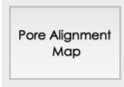

# ImAP

ImAP is a python program for image analysis of porous materials. 

It allows you to quickly gather information on pore structure such as porosity and pore alignment percentage. User-friendly preview windows allow you to see the effect of input variables so that it is easy to optimize the input values to produce accurate results. It is also capable of generating high-resolution pore alignment maps, showing aligned and misaligned pore areas visually.

## Installation 

You'll need Python 3 and several other python packages including matplotlib, PyQt5, cv2, numpy, and os. If any of those are not installed on your computer. Use the package manager *pip* to install them. For example:

````python
pip install opencv-python
````

```python
pip install matplotlib
```

## Usage

Once the script is run, a graphical user interface should appear.


To select the image you want to analyze, click  and the image you choose should appear on the right window.


There are three variables you can change in the program: **gray value**, **pore density**, and **crop size**.

### Porosity

**Gray value** specifies a gray value below which that point of the image will be identified as pore area. The default is set to 70. The input can be any integer between  0 to 255.

The larger the number is, the more area is identified as pore. 


Once a **gray value** is inserted, click  to see which areas are counted as pores. Click  to calculate the percentage of pore area out of the whole image (porosity).

### Pore alignment

**Pore density** determines whether a point is considered an aligned-pore region or not based on the surrounding area of that point. This value will be compared to (pore area in crop size)/(whole area in crop size) of each point. In theory, this is a comparison of the pore area. In practice, if the contrast between the pores and the pore walls is small or to eliminate the influence of the pore size, a smaller gray value should be used so that only the center part of each pore is counted. This way, the pore density is effectively a measurement of the number, rather than the area, of pores in the selected area (determined by the crop size). The default is set to 15. The input can be any integer between  0 to 100.

**Crop size** determines the size of the surrounding area of a point used to determine the pore alignment. The crop size should be larger than the pore size so that each cropped image for analysis contains several pores in it's an aligned-pore region. The default is set to 50 px. The input can be any integer between  1 to the height and width of your sample.

Once, a **pore density** and a **crop size** are inserted, click  to see a quick mapping of aligned (green)- and misaligned (purple)- pore regions. The percentage of aligned pore area will be displayed at the bottom of the window.


If the resulting image does not correctly identify aligned and misaligned regions, change the values used for **gray value**, **pore density**, and **crop size**. 

*Tips: A smaller **gray value** should be used if the image contrast is small or if you want to eliminate the influence of the pore size so that only the center part of each pore is identified. This way, the pore density is effectively a measurement of the number of pores in the selected area (determined by the crop size). This usually produces a better pore alignment mapping.*

If the resulting image correctly identifies aligned and misaligned regions, click  to generate a high-resolution pore alignment map. The image will be saved to the same directory as the ImAP.py program.


## Reference

The images used for analysis here are taken from *Naviroj, Maninpat, et al. Nucleation-controlled freeze casting of preceramic polymers for uniaxial pores in Si-based ceramics. Scripta Materialia 130 (2017): 32-36.*

